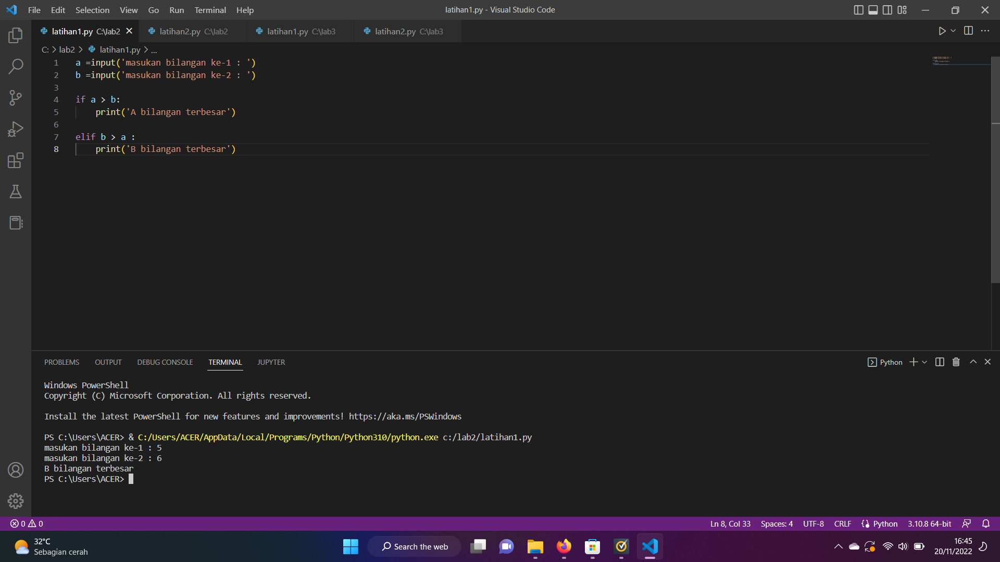
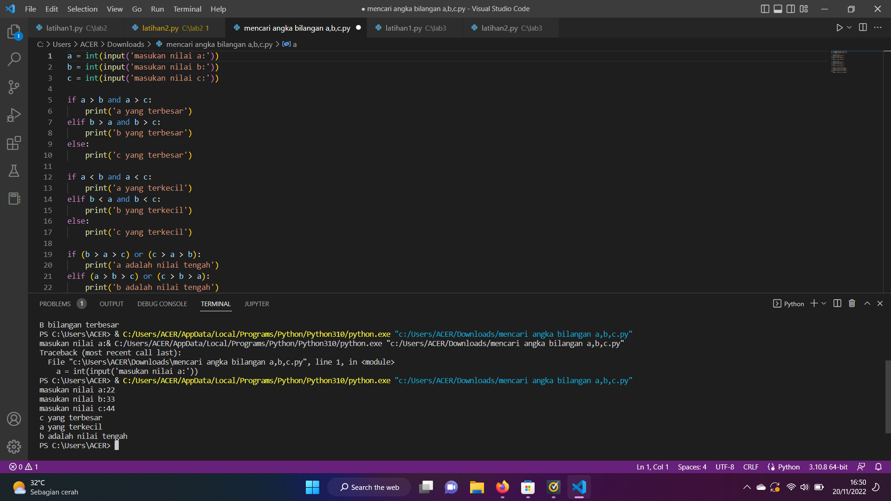
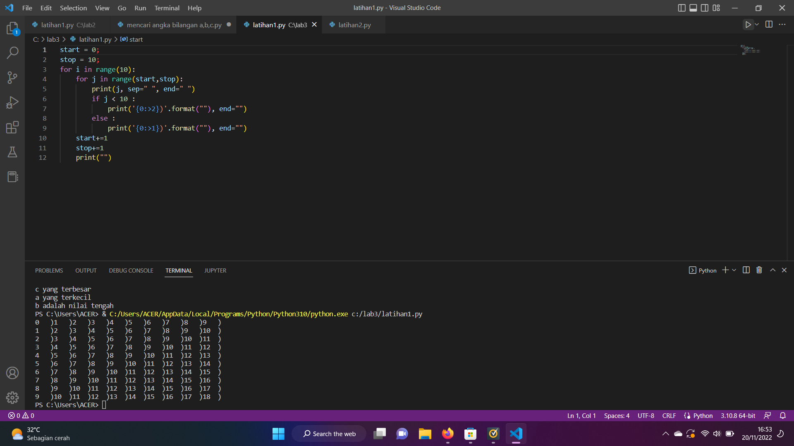

# praktikum077
## LATIHAN 1
## MEMBUAT PROGRAM DENGAN MENGINPUT 2 BUAH BILANGAN UNTUK MENENTUKAN BILANGAN TERBESAR MENGGUNAKAN STATEMENT IF
# Source Code & Output (Hasil Running Program)
Berikut ini adalah Source Code Latihan 1 :

a = int(input("bilangan a : "))
b = int(input("bilangan b : "))

if a > b:
    print(f"terbesar adalah {a}")
elif b > a :
    print(f"terbesar adalah {b}")
    

# LATIHAN 2
## MEMBUAT PROGRAM UNTUK MENGURUTKAN DATA SECARA BERURUTAN MULAI DARI DATA TERKECIL

## Source Code & Output (Hasil Running Program)
Berikut ini adalah Source Code Latihan 2 :

a, b, c = (
    int(input("Masukan nilai Ke-1: ")),
    int(input("Masukan nilai Ke-2: ")),
    int(input("Masukan nilai Ke-3: "))
)
if a<b and a<c:
    if b<c:
        print("Urutan Bilangan : ",a,b,c)
    else:
        print("Urutan Bilangan : ",a,c,b)
elif b<a and b<c:
    if a<c:
        print("Urutan Bilangan : ",b,a,c)
    else:
        print("Urutan Bilangan : ",b,c,a)
else:
    if a<b:
        print("Urutan Bilangan : ",c,a,b)
    else:
        print("Urutan Bilangan : ",c,b,a)

# LATIHAN 3
## MEMBUAT PROGRAM DENGAN PERULANGAN BERTINGKAT 

## Source Code & Output (Hasil Running Program)
Berikut ini adalah Source Code Latihan 3 :

start = 0;
stop = 10;
for i in range(10):
    for j in range(start,stop):
        print(j, sep=" ", end=" ")
        if j < 10 :
            print('{0:>2}'.format(""), end="")
        else :
            print('{0:>1}'.format(""), end="")
    start+=1
    stop+=1
    print("")

# LATIHAN 4
## MEMBUAT PROGRAM BILANGAN ACAK YANG LEBIH KECIL DARI 0.5 MENGGUNAKAN KOMBINASI WHILE DAN FOR

## Source Code & Output (Hasil Running Program)
Berikut ini adalah Source Code LATIHAN 4 :

import random

jumlah = int(input("Masukan Jumlah Nilai :"))
for i in range(jumlah):
    i=random.uniform(0.0,0.5)
    print("Data Ke:", i)

